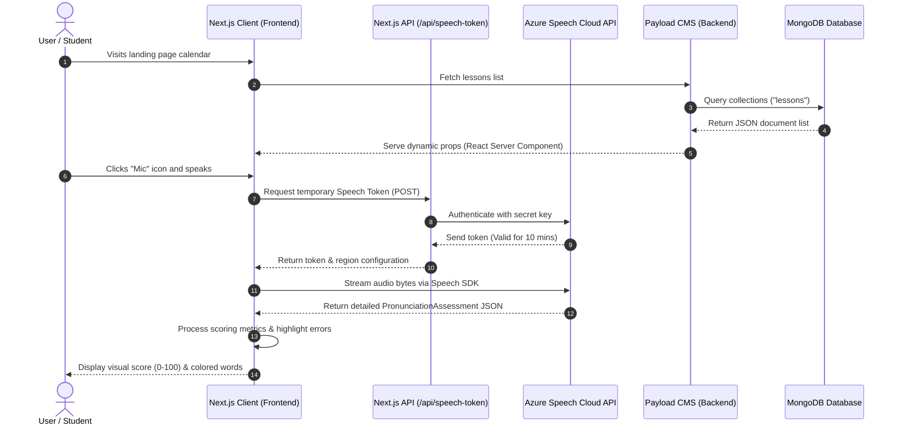

# Momtek Event: Tet Holiday 2026 🎆

[](https://nextjs.org/)
[](https://payloadcms.com/)
[](https://www.mongodb.com/)
[](https://azure.microsoft.com/en-us/products/cognitive-services/speech-to-text/)
[](https://vitest.dev/)
[](https://www.typescriptlang.org/)
[](https://opensource.org/licenses/MIT)

An interactive, high-fidelity fullstack English learning platform designed for children during the Lunar New Year (Tet Holiday) 2026. The application gamifies holiday homework through dynamic video integrations (YouTube & TikTok) and real-time AI-powered pronunciation grading.

---

## 📖 Project Description

### What is this project?
**Momtek Event: Tet Holiday 2026** is a modern, responsive web application engineered to keep children engaged in English education during festive holidays. Designed around a **12-day curriculum**, it offers an interactive schedule of lessons centered on classic children's songs. 

### What problem does it solve?
Traditional holiday homework suffers from low engagement, and children often lose momentum in vocabulary retention and pronunciation frequency during long breaks. Moreover, existing learning tools lack real-time feedback on pronunciation accuracy, making self-guided study ineffective.

### Why did I build it?
I built this platform to demonstrate how modern web technologies (Next.js 16, React 19, Tailwind CSS v4, and Payload CMS 3) can be combined with cloud AI services to solve real education-tech challenges. By integrating **Microsoft Azure Cognitive Speech Services** and writing a custom TikTok player synchronization engine, I created a frictionless, premium experience that runs smoothly on desktop and mobile devices.

---

## 📸 Demo & Screenshots

Here is a placeholder preview of the platform interface. You can replace these with actual screenshots or GIFs showing the responsive schedule and the AI assessment panel.

| 📅 12-Day Interactive Calendar Dashboard | 🎙️ Real-time AI Pronunciation Scorer |
|:---:|:---:|
|  |  |

> 🔗 **Live Demo Link:** [https://momtek-event-frontend.vercel.app](https://momtek-event-frontend.vercel.app) *(Update with your production deployment)*

---

## ✨ Core Features

- **🎙️ Real-time AI Pronunciation Scoring**
  Streams recorded microphone audio directly to **Microsoft Azure's Speech SDK**. It compares the spoken output against target English phrases, rendering instant performance scores based on **Accuracy**, **Completeness**, and **Fluency**.
- **🎨 Interactive Word-level Error Highlighting**
  Decodes complex JSON assessments from the speech engine to color-code individual words on-screen. Highlights pronunciation flaws instantly:
  - <kbd><span style="color: #22c55e;">Green</span></kbd> for excellent pronunciation.
  - <kbd><span style="color: #ef4444; text-decoration: line-through;">Red (Strikethrough)</span></kbd> for mispronounced words.
  - <kbd><span style="color: #94a3b8;">Gray</span></kbd> for omitted/skipped words.
  - <kbd><span style="color: #a855f7;">Purple</span></kbd> for inserted extra words.
- **📱 Custom Hybrid Media Player (YouTube & TikTok)**
  Implements a custom-built iframe controller which integrates both YouTube and TikTok. To resolve aggressive mobile browser autoplay blocks, it uses cross-origin `postMessage` listeners to communicate with the TikTok Player API to safely play media in muted mode on load, and shows a custom floating unmute trigger once the video begins.
- **🔒 Daily Lesson Lock & Unlock Engine**
  Features a calendar grid routing system. Administrative operators can toggle a `isFree` checkmark in Payload CMS to dynamically lock premium lessons or unlock free content.
- **⚙️ Headless Content Management (Payload CMS 3.0)**
  Administrators can effortlessly create, read, update, and delete lessons, vocabulary lists, phonemic transcriptions, translations, and media uploads through a centralized Next.js-powered CMS dashboard.
- **🧪 Comprehensive Test Suites**
  Backed by integrated database and schema API tests using **Vitest**, alongside fully automated end-to-end browser workflows powered by **Playwright**.

---

## 🛠️ Tech Stack & Tools

### Frontend
- **Framework:** Next.js 16.1.6 (App Router) & React 19.0.0 (Client/Server components)
- **Styling:** Tailwind CSS v4 (Sleek CSS configuration) & Framer Motion v12 (Micro-animations)
- **Icons:** Lucide React

### Backend & CMS
- **Platform:** Payload CMS 3.74.0 (TypeScript-first Next.js headless CMS)
- **Database:** MongoDB Atlas via Mongoose Adapter (`@payloadcms/db-mongodb`)
- **JSON Web Tokens (JWT):** Next-auth integration under Payload security controls

### Third-Party APIs
- **AI Assessment:** Microsoft Cognitive Services Speech SDK (`microsoft-cognitiveservices-speech-sdk`)
- **Video Players:** Custom YouTube & TikTok Player Web APIs

### DevOps & Testing
- **E2E Testing:** Playwright 1.56.1
- **Unit/Integration Testing:** Vitest 3.2.3 & JSDOM
- **Containerization:** Docker & Docker Compose (Local DB replica setting)

---

## 🏗️ Architecture & System Design

The application utilizes a decoupled, modern multi-tier structure. The diagram below illustrates the data flow between the Next.js client interface, local serverless APIs, the Payload CMS admin engine, and Azure's Cognitive Speech cloud.



### Key Architectural Decisions:
1. **Shared Runtime (Payload + Next.js):** By selecting Payload CMS 3.0, the backend administrative interface is integrated directly into the Next.js framework. Both run as a unified application, reducing deployment overhead, hosting costs, and standardizing development tooling.
2. **Token Exchange Proxy Pattern:** To avoid exposing sensitive keys (`AZURE_SPEECH_KEY`) to the browser, the client makes a serverless POST request to `/api/speech-token`. The server exchanges credentials for a short-lived session token (expires in 10 minutes) and sends it back to the client, preserving cloud resource security.
3. **Rigorous Pronunciation Metric Override:** The application implements a customized scoring modifier (`processStrictResult`) on top of Azure's defaults. If a student skips words (Omission) or speaks with a very low speed, the algorithm penalizes the overall accuracy score to prevent students from cheating by reciting only single words of a sentence.

---

## ⚙️ Getting Started

### Prerequisites
- Node.js >= 18.20.2
- MongoDB (Local server or MongoDB Atlas URI)
- Microsoft Azure Subscription with a Speech Cognitive service resource

### Environment Configurations

Create environment files in both folders.

#### 1. Backend config (`backend/.env`):
```env
DATABASE_URI=mongodb://127.0.0.1:27017/momtek-event
PAYLOAD_PUBLIC_SERVER_URL=http://localhost:3000
PAYLOAD_SECRET=your_generated_random_payload_secret
```

#### 2. Frontend config (`frontend/.env.local`):
```env
NEXT_PUBLIC_API_URL=http://localhost:3000
NEXT_PUBLIC_SITE_URL=http://localhost:3001
AZURE_SPEECH_KEY=your_azure_cognitive_speech_subscription_key
AZURE_SPEECH_REGION=southeastasia
```

---

### Step-by-Step Installation

#### Step 1: Set up the Backend (CMS)

1. Navigate to the backend directory:
   ```bash
   cd backend
   ```
2. Install dependencies:
   ```bash
   pnpm install
   ```
3. Start the local development server (or run with Docker):
   - **Local Node setup:**
     ```bash
     pnpm run dev
     ```
   - **Docker Setup (Runs local Next.js + MongoDB Container):**
     ```bash
     docker-compose up -d
     ```
4. Access the Payload CMS control panel at `http://localhost:3000/admin` to set up your administrator credentials, configure the dynamic "lessons" data, and upload image assets.

#### Step 2: Set up the Frontend

1. Navigate to the frontend directory:
   ```bash
   cd ../frontend
   ```
2. Install dependencies:
   ```bash
   npm install
   ```
3. Start the React/Next.js dev engine:
   ```bash
   npm run dev
   ```
4. Open `http://localhost:3001` (or your local port printed in the terminal) in your browser.

#### Step 3: Run Testing Suites (Backend)

To execute unit, integration, and E2E browser tests:
```bash
cd backend
pnpm run test:int     # Executes integration tests using Vitest
pnpm run test:e2e     # Launches chromium browser E2E workflows using Playwright
pnpm run test         # Runs both test suites sequentially
```

---

## 📁 Project Structure

Below is an overview of the code organization, showing how the frontend user interface connects with the backend content management architecture.

```text
momtek-event/
├── backend/                  # Payload CMS 3.0 Server (Next.js 15)
│   ├── src/
│   │   ├── app/              # Next.js App Router for admin panel & custom routes
│   │   ├── collections/      # Payload collection definitions (Users, Media, Lessons)
│   │   │   ├── Users.ts      # Admin accounts definition
│   │   │   ├── Media.ts      # Media/assets storage properties
│   │   │   └── Lessons.ts    # Main course/days content schema (with sub-arrays)
│   │   └── payload.config.ts # Core configuration (DB adapter, Lexical editor)
│   ├── tests/                # Automated testing suite
│   │   ├── e2e/              # E2E test suites with Playwright
│   │   └── int/              # Integration tests with Vitest
│   ├── docker-compose.yml    # Docker configuration for local MongoDB deployment
│   ├── Dockerfile            # Container build specification
│   └── package.json          # Node dependencies & automation scripts
└── frontend/                 # Client Interface (Next.js 16 + React 19)
    ├── src/
    │   ├── app/              # Frontend pages and endpoints
    │   │   ├── api/          # Serverless route handlers (Azure Speech Token exchange)
    │   │   │   └── speech-token/route.ts
    │   │   ├── learn/        # Dynamic course pages
    │   │   │   └── [slug]/page.tsx
    │   │   ├── globals.css   # Main CSS system
    │   │   ├── layout.tsx    # Layout and styling wrappers
    │   │   └── page.tsx      # Main event landing page (roadmap calendar)
    │   ├── components/       # Custom React components
    │   │   ├── PronunciationScorer.tsx # AI speech analyzer client component
    │   │   ├── VideoPlayerSection.tsx  # Embedded custom TikTok/YouTube player
    │   │   ├── TeacherAvatar.tsx       # Teacher badge displays
    │   │   └── TestimonialCard.tsx     # Dynamic event info card
    │   ├── lib/              # Client API wrappers (Axios services)
    │   │   └── api.ts        # Operations fetching database collections
    │   └── types/            # Shared TypeScript interface definitions
    │       └── lesson.ts     # Structures of lessons & vocabs
    └── package.json          # Frontend packages & build tasks
```

---

## 🔌 API Reference

### Speech Authentication (Frontend API Proxy)
- **Endpoint:** `/api/speech-token`
- **Method:** `POST`
- **Description:** Exposes Azure configuration options to the browser client dynamically.
- **Response Format:**
  ```json
  {
    "token": "eyJhbGciOiJSUzI1NiIsImtpZCI6Ik...",
    "region": "southeastasia"
  }
  ```

### Lessons Catalog (Payload CMS REST API)
- **Endpoint:** `/api/lessons`
- **Method:** `GET`
- **Parameters:** `?limit=100` or `?where[slug][equals]=lesson-slug`
- **Description:** Returns the listing or detailed parameters of structured lessons.
- **Sample JSON Output Document:**
  ```json
  {
    "id": "60c72b2f9b1d8b23485642a8",
    "title": "Danh mục bài tập",
    "description": "Tên bài tập",
    "slug": "ten-bai-tap",
    "isFree": true,
    "lyrics": "This is the lyric of the song.",
    "videoPlatform": "youtube",
    "videoUrl": "https://www.youtube.com/watch?v=...",
    "content": [
      {
        "id": "60c72b2f9b1d8b23485642a9",
        "phrase": "Merry Christmas and Happy New Year",
        "transcription": "me-ri kris-mas ænd hæ-pi nu jɪər",
        "translation": "Chúc mừng Giáng sinh và Chúc mừng năm mới",
        "difficulty": "easy"
      }
    ]
  }
  ```

---

## 🗺️ Upcoming Features / Roadmap

- [ ] **📊 Student Progress Analytics:** Build a graphical progress dashboard for parents to monitor daily accuracy metrics and streaks.
- [ ] **🔊 Audio Playback & Comparison:** Allow students to record their voice and play it back alongside a native-speaker voice model.
- [ ] **🃏 AI-Generated Vocabulary Flashcards:** Dynamically convert lessons' key phrases into flashcards using spaced repetition (SRS).
- [ ] **🏆 Global Hall of Fame:** Implement a seasonal leaderboard showcasing student achievements and perfect pronunciation streaks.

---


---
*Developed with dedication for the Momtek English Education community.* 🎆
